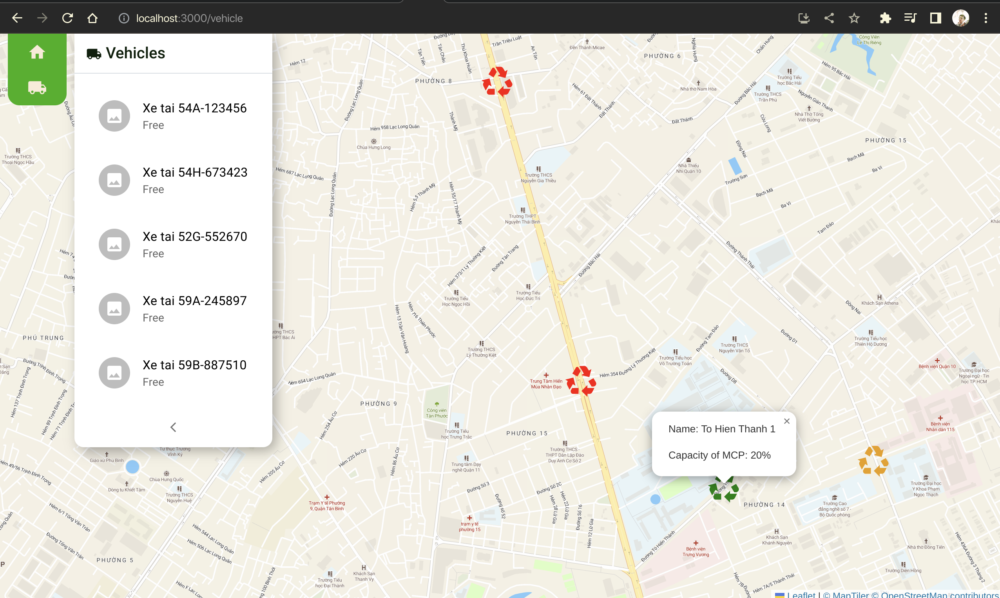

# Assignment UWC-2.0

## Run the app
Command to build and run the application:  
`docker compose up --build`

Access the application:  
`localhost:3000`

## Development
Hot reload is enabled by environment value in **docker-compose.yml**

Port configuration is located in **docker-compose.yml**
Example: edit 3000:3000 to 8080:3000 to run the application at port 8080.

## UI update log
**date:** 12/04/2023
